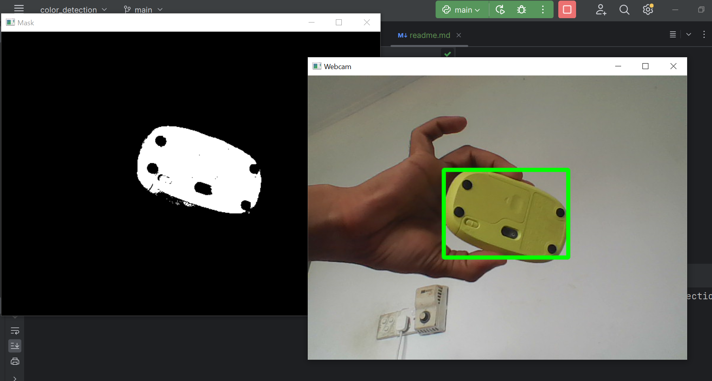

Certainly! Below is the `README.md` content based on the provided code:

---

# Object Tracking with OpenCV

This Python script performs object tracking based on color using OpenCV. It captures frames from the webcam, converts them to the HSV color space, and detects objects within a specified color range.

## Dependencies

- OpenCV
- NumPy
- Pillow

You can install the dependencies using pip:

```bash
pip install opencv-python numpy pillow
```

## Usage

1. Run the script `object_tracking.py`.
2. Press 'q' to quit the application.

## Description

The script detects objects within a specified color range (e.g., yellow). It uses the `cv2.inRange()` function to generate a binary mask based on the HSV color space. Then, it converts the mask to a Pillow image and retrieves the bounding box using the `getbbox()` function. Finally, it draws a rectangle around the detected object in the original frame.

## File Structure

- `main.py`: Main Python script for object tracking.
- `utill.py`: Utility functions, including `get_limits()` for obtaining HSV color range from BGR.
- `README.md`: This file.


## Example 
#### detection yellow color objects




---

